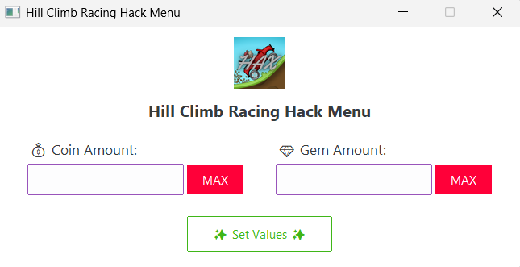

# 🏁 Hill Climb Racing Hack Menu

A Python-based GUI tool built using **Tkinter** and **ttkbootstrap** to modify in-game resources (Coins & Gems) for **Hill Climb Racing** on Windows.  
This tool attaches to the game process (`HillClimbRacing.exe`) and allows real-time memory editing for educational and testing purposes.

---

## ⚙️ Features

- 🧩 **Automatic Process Detection** — detects if `HillClimbRacing.exe` is running  
- 💰 **Read & Edit Coins and Gems** directly from memory  
- 💥 **Set to MAX (2147483647)** with a single click  
- 🧠 **Modern UI** built with [`ttkbootstrap`](https://github.com/israel-dryer/ttkbootstrap)  
- 🪶 **Lightweight and portable** — no installer required  
- 🔗 **Quick link to GitHub repo**

---

## 🖥️ Requirements

Windows PC/Laptop with Administrator Permissions running Hill Climb Racing
> ⚠️ Note: Mac and Linux are NOT Supported!

---

## 📦 Download

- **[⬇️ Download the latest release here](../../releases/latest)**

---

## 🚀 Usage

1. **Launch Hill Climb Racing** on your PC.
2. **Run the EXE**:  
   Double-click `main.exe` (or the EXE you downloaded/built).
3. Wait for the GUI window to appear.
4. If the game is running, current **Coins** and **Gems** will be displayed automatically.
5. Enter new values and click **✨ Set Values ✨**.
6. (Optional) Click **MAX** to set values to the maximum (2,147,483,647).

---

## 🧠 How It Works

This tool:
1. Uses **`Pymem`** to attach to the process `HillClimbRacing.exe`.  
2. Parses module addresses using `module_from_name` and the predefined memory offsets:
   - `ADDR_COINS = HillClimbRacing.exe+28CAD4`
   - `ADDR_GEMS  = HillClimbRacing.exe+28CAEC`
3. Reads/writes memory values via direct pointer access.
4. Displays data inside a simple Tkinter GUI using **ttkbootstrap** for modern styling.

---

## 🧩 Memory Addresses

| Resource | Address Offset | Example Value |
|-----------|----------------|----------------|
| Coins | `HillClimbRacing.exe+28CAD4` | 999999 |
| Gems  | `HillClimbRacing.exe+28CAEC` | 5000   |

---

## 🧰 Logging

The tool provides helpful log messages in the console:
- `[INFO]` — successful operations (attach, read, write)
- `[WARNING]` — missing process or invalid input
- `[ERROR]` — any read/write or attach errors

---

## 🧑‍💻 Credit

Developed by **[S4IL](https://github.com/S4IL21)**  
Packaged by **[VihaanVP](https://github.com/vihaanvp)**
> “Made with ❤️ for fun and learning.”

Original GitHub Repository:  
[https://github.com/S4IL21/Hill-Climb-Racing-Hacks](https://github.com/S4IL21/Hill-Climb-Racing-Hacks)

---

## ⚠️ Disclaimer

This project is for **educational purposes only**.  
Modifying game memory may violate the game’s terms of service or cause instability.  
Use responsibly and at your own risk.

---

## 📸 Screenshot

---

### 🏎️ Enjoy hacking Hill Climb Racing!